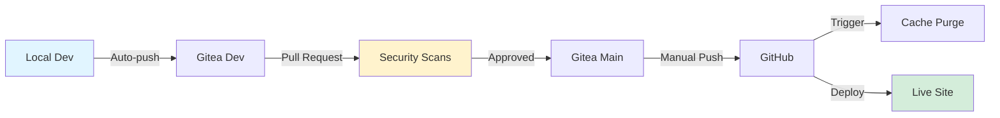

# BuildTest Development Workflow

<div align="center">


**Secure, automated development workflow with multi-stage deployment**

[Live Site](https://buildtest.dev) • [Documentation](#workflow) • [Security](#security)

</div>

---

## Overview

A security-first development workflow that combines private Gitea hosting with public GitHub deployment, featuring automated security scanning and intelligent cache management.



### Key Features

| Feature | Description |
|---------|-------------|
| **Security Gate** | Gitea acts as private security checkpoint before public release |
| **Auto Scanning** | TruffleHog + Gitleaks detect secrets automatically |
| **Smart Cache** | Cloudflare cache purges on deployment |
| **Manual Control** | No automatic public deployments |
| **Git Hooks** | Automated dev branch pushes |

---

## Architecture

<details open>
<summary><b>Core Components</b></summary>

```
┌─────────────────┐
│   Ubuntu VM     │
│  (Development)  │
└────────┬────────┘
         │
         ▼
┌─────────────────┐      ┌──────────────┐
│  Gitea Server   │◄─────┤ Gitea Runner │
│   (Private)     │      │   (Docker)   │
└────────┬────────┘      └──────────────┘
         │
         ▼
┌─────────────────┐      ┌──────────────┐
│  GitHub Repo    │◄─────┤   Actions    │
│   (Public)      │      │ Cache Purge  │
└────────┬────────┘      └──────────────┘
         │
         ▼
┌─────────────────┐
│ GitHub Pages +  │
│   Cloudflare    │
│ buildtest.dev   │
└─────────────────┘
```

### Technology Stack

| Layer | Technology | Purpose |
|-------|-----------|---------|
| **Development** | Ubuntu VM + VS Code | Local development environment |
| **Build** | Jekyll + Bundler | Static site generation |
| **Primary Repo** | Self-hosted Gitea | Private development & security gate |
| **Public Mirror** | GitHub | Deployment target |
| **Hosting** | GitHub Pages | Static site hosting |
| **CDN** | Cloudflare | DNS + caching + performance |
| **CI/CD** | Gitea Actions + GitHub Actions | Automated workflows |

</details>

---

## Workflow

### Development Pipeline

```bash
# Stage 1: Local Development
┌─────────────────────────────────────┐
│ 1. Edit code in VS Code             │
│ 2. Jekyll auto-serves (localhost)   │
│ 3. Commit to 'dev' branch           │
│ 4. Auto-push to Gitea via git hook  │
└─────────────────────────────────────┘
                 ↓
# Stage 2: Security Gate
┌─────────────────────────────────────┐
│ 5. Create PR: dev → main            │
│ 6. TruffleHog scans for secrets     │
│ 7. Gitleaks scans for credentials   │
│ 8. Review & approve if clean        │
│ 9. Merge to Gitea main              │
└─────────────────────────────────────┘
                 ↓
# Stage 3: Public Deployment
┌─────────────────────────────────────┐
│ 10. Manual push to GitHub           │
│ 11. GitHub Actions purges CF cache  │
│ 12. GitHub Pages deploys            │
│ 13. Live on buildtest.dev           │
└─────────────────────────────────────┘
```

### Branch Strategy

<table>
<tr>
<th>Branch</th>
<th>Purpose</th>
<th>Protection</th>
<th>Automation</th>
</tr>
<tr>
<td><code>dev</code></td>
<td>Active development</td>
<td>None</td>
<td>Auto-push to Gitea</td>
</tr>
<tr>
<td><code>main</code></td>
<td>Production</td>
<td>Requires PR approval</td>
<td>Security scans on PR</td>
</tr>
</table>

---

## Security

<details>
<summary><b>Multi-Layer Security Architecture</b></summary>

### Automated Scanning

| Tool | Purpose | Trigger | Action |
|------|---------|---------|--------|
| **TruffleHog** | Detects API keys, tokens, secrets | Every PR to `main` | Block merge if found |
| **Gitleaks** | Scans for hardcoded credentials | Every PR to `main` | Block merge if found |

### Security Workflow

```yaml
┌──────────────────┐
│  Code Changes    │
└────────┬─────────┘
         │
         ▼
┌──────────────────┐
│  Pull Request    │
└────────┬─────────┘
         │
         ▼
┌──────────────────┐
│ TruffleHog Scan  │
│  Gitleaks Scan   │
└────────┬─────────┘
         │
    ┌────┴────┐
    │         │
 Issues   Clean
    │         │
    ▼         ▼
 Block    Approve
           │
           ▼
      ┌────────┐
      │ Merge  │
      └────────┘
```

### Protection Mechanisms

- **Direct Push Blocked** — No direct commits to `main` allowed
- **Approval Required** — Minimum 1 reviewer must approve
- **Private Gate** — Gitea reviews before public GitHub
- **Manual Control** — No automatic GitHub mirroring

</details>

---

## Automation

### Git Hooks

**Post-Commit Hook**
```bash
# Automatically pushes dev branch to Gitea after every commit
.git/hooks/post-commit
```

### Gitea Actions

<details>
<summary><b>Security Scanning Workflow</b></summary>

**File:** `.gitea/workflows/security-scan.yml`

**Triggers:** Pull requests to `main` branch

**Actions:**
- Checkout code
- Run TruffleHog filesystem scan
- Run Gitleaks via Docker
- Report results
- Block merge if issues found

</details>

### GitHub Actions

<details>
<summary><b>Cloudflare Cache Purge Workflow</b></summary>

**File:** `.github/workflows/purge-cloudflare.yml`

**Triggers:** Push to `main` branch

**Actions:**
- Authenticate with Cloudflare API
- Purge entire site cache
- Ensure fresh content delivery

**Secrets Required:**
- `CF_ZONE_ID` — Cloudflare zone identifier
- `CF_API_TOKEN` — API authentication token

</details>

### VS Code Integration

**Auto-Serve Task** (`.vscode/tasks.json`)
```json
{
  "label": "Jekyll Serve",
  "type": "shell",
  "command": "bundle exec jekyll serve --host 0.0.0.0",
  "runOptions": {
    "runOn": "folderOpen"
  }
}
```

---

## Local Development

### Prerequisites

```bash
# Required software
Jekyll 4.3+
Ruby 3.0+
Bundler 2.0+
Git 2.0+
VS Code (recommended)
```

### Quick Start

```bash
# 1. Clone repository
git clone <gitea-url> buildtest-site
cd buildtest-site

# 2. Install dependencies
bundle install

# 3. Open in VS Code (auto-starts Jekyll)
code .

# 4. View local site
open http://localhost:4000
```

### Git Remotes

```bash
# View configured remotes
git remote -v

# Expected output:
gitea   https://gitea.buildtest.dev/jekyll/repo.git (fetch)
gitea   https://gitea.buildtest.dev/jekyll/repo.git (push)
origin  https://github.com/jupitertechAU/repo.git (fetch)
origin  https://github.com/jupitertechAU/repo.git (push)
```

### Development Commands

| Command | Purpose |
|---------|---------|
| `bundle exec jekyll serve` | Start local development server |
| `bundle exec jekyll build` | Build static site |
| `git commit -m "message"` | Commit + auto-push to Gitea dev |
| `git push origin main` | Manual push to GitHub (after merge) |

---

## Infrastructure

### Hosting Stack

```
                ┌──────────────┐
                │   Visitor    │
                └──────┬───────┘
                       │
                       ▼
                ┌──────────────┐
                │  Cloudflare  │
                │   CDN/Cache  │
                └──────┬───────┘
                       │
                       ▼
                ┌──────────────┐
                │ GitHub Pages │
                │buildtest.dev │
                └──────────────┘
```

### Component Details

<table>
<tr>
<th>Component</th>
<th>Details</th>
</tr>
<tr>
<td><b>Gitea Server</b></td>
<td>
• Self-hosted on local infrastructure<br>
• Private development repository<br>
• Branch protection enabled<br>
• Docker-based runner for Actions
</td>
</tr>
<tr>
<td><b>Development VM</b></td>
<td>
• Ubuntu 24.04 LTS<br>
• VS Code with Jekyll extensions<br>
• Auto-serve configuration<br>
• Git hooks installed
</td>
</tr>
<tr>
<td><b>Cloudflare</b></td>
<td>
• DNS management<br>
• CDN/edge caching<br>
• API-based cache purging<br>
• SSL/TLS encryption
</td>
</tr>
<tr>
<td><b>GitHub</b></td>
<td>
• Public mirror repository<br>
• GitHub Pages hosting<br>
• Actions for cache management<br>
• Custom domain (buildtest.dev)
</td>
</tr>
</table>

---

## Progress Tracking

### Completed Tasks

<details open>
<summary><b>Development (5/5)</b></summary>

- [x] Configure Gitea Actions for automated testing
- [x] Set up Git hooks for automated Gitea pushes
- [x] Configure VS Code auto-serve on folder open
- [x] Establish branch protection with PR workflow
- [x] Configure dual remote setup (Gitea + GitHub)

</details>

<details open>
<summary><b>Security (4/4)</b></summary>

- [x] Implement automated security scanning (TruffleHog + Gitleaks)
- [x] Configure security scans on pull requests
- [x] Set up Gitea as security gate before public mirror
- [x] Establish manual deployment control to prevent auto-leaks

</details>

<details open>
<summary><b>Infrastructure (3/3)</b></summary>

- [x] Implement automatic Cloudflare cache purging on deployment
- [x] Configure Cloudflare API integration via GitHub Actions
- [x] Secure API token storage using GitHub secrets

</details>

### TODO

<details>
<summary><b>Security Enhancements (5 items)</b></summary>

- [ ] Test security scanners with sample credentials
- [ ] Verify detection of hardcoded secrets and API keys
- [ ] Audit historical commits for accidentally leaked credentials
- [ ] Document secret rotation procedures
- [ ] Create security incident response plan

</details>