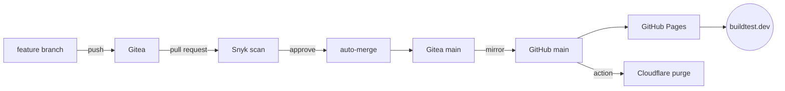

# BuildTest.dev

<div align="center">


**Private-Gitea-gated, GitHub-deployed Jekyll site.**

[Live](https://buildtest.dev) · [Workflow](#workflow) · [Security](#security) · [Local Dev](#local-development)

</div>

---

## Overview

Source of truth is a self-hosted Gitea instance which runs the security gate. Approved changes propagate to a public GitHub mirror, which GitHub Pages builds and deploys to `buildtest.dev`. Cloudflare fronts the live site and is purged on each deploy.


```mermaid
graph LR
    A[feature branch] -->|push| B[Gitea]
    B -->|pull request| C[Snyk scan]
    C -->|approve| D[auto-merge]
    D --> E[Gitea main]
    E -->|mirror| F[GitHub main]
    F --> G[GitHub Pages]
    F -->|action| H[Cloudflare purge]
    G --> I((buildtest.dev))
```

---

## Workflow

| # | Step | Where |
|---|---|---|
| 1 | Branch off `main`: `git checkout -b feature/<name>` | local |
| 2 | Commit — pre-commit hook bumps the build counter; post-commit pushes the branch to Gitea | local + Gitea |
| 3 | PR opened `feature → main` via Gitea API by a dedicated bot user, with a reviewer requested | Gitea |
| 4 | Snyk scans run on `pull_request` (Open Source + Code) | Gitea Actions |
| 5 | Reviewer approves on the **Files Changed** tab | Gitea |
| 6 | PR auto-merges once approvals + checks pass (`merge_when_checks_succeed`) | Gitea |
| 7 | `git pull gitea main && git push origin main` to mirror | local |
| 8 | GitHub Pages builds; cache-purge Action invalidates Cloudflare | GitHub |

Direct pushes to `main` are restricted by branch protection on both remotes; all changes flow through PRs.

---

## Security

| Layer | Tool | Trigger | What it does |
|---|---|---|---|
| Dependency scan | Snyk Open Source | every PR | scans `Gemfile.lock` for known CVEs |
| Static analysis | Snyk Code | every PR | flags risky code patterns |
| Branch protection | Gitea | always | 1 approval required, push whitelist enforced |
| Secrets | Gitea Actions secrets | runtime | `SNYK_TOKEN`, `CF_API_TOKEN`, `CF_ZONE_ID` |

Scan results post to the PR; high-severity findings appear in the run log even when the workflow exits green.

---

## Local Development

### Prerequisites

- Ruby (matching the version GitHub Pages uses)
- Bundler
- Git

### Setup

```bash
git clone https://gitea.buildtest.dev/jekyll/buildtestdev-simple.git
cd buildtestdev-simple
bundle install
bundle exec jekyll serve --livereload
# → http://localhost:4000
```

### Remotes

```
origin  https://github.com/jupitertechAU/buildtestdev-simple   # public, GitHub Pages source
gitea   https://gitea.buildtest.dev/jekyll/buildtestdev-simple # private, source of truth
```

### Git Hooks

| Hook | Action |
|---|---|
| `pre-commit` | Bumps `_data/version.yml` build counter, re-stages |
| `post-commit` | `git push gitea <current-branch>` |

### Common Commands

| Command | Purpose |
|---|---|
| `bundle exec jekyll serve --livereload` | Local dev server on `localhost:4000` |
| `bundle exec jekyll build` | Static build into `_site/` |
| `git checkout -b feature/<name>` | Start a change |
| `git pull gitea main && git push origin main` | Mirror Gitea → GitHub after merge |

---

## Infrastructure

| Component | Role |
|---|---|
| Gitea | private source of truth; PR gate; Actions runner |
| GitHub | public mirror; GitHub Pages source |
| GitHub Pages | static site build + serve |
| Cloudflare | DNS, edge cache, TLS |
| `purge-cloudflare.yml` | GitHub Action — purges Cloudflare cache on push to `main` |

```
visitor → Cloudflare (cache/TLS) → GitHub Pages → buildtest.dev
```

---

## Repository Layout

```
.
├── _config.yml              # Jekyll config (uses remote_theme: mmistakes/minimal-mistakes)
├── _data/
│   ├── services.yml         # Service catalog rendered on the homepage
│   └── version.yml          # Auto-incrementing build counter (managed by pre-commit hook)
├── _includes/  _layouts/  _sass/
├── assets/icons/            # Service icons
├── index.html               # Homepage (Liquid template)
├── Gemfile / Gemfile.lock   # Pinned via github-pages gem
├── .gitea/workflows/        # Gitea Actions (Snyk scan)
└── .github/workflows/       # GitHub Actions (Cloudflare cache purge)
```
